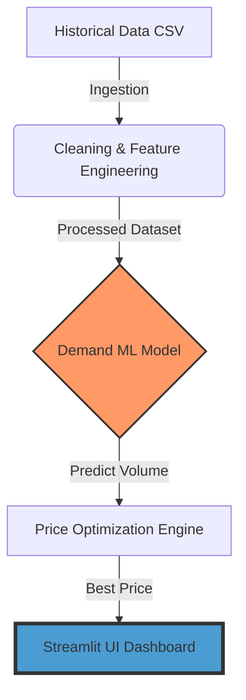

# ⛽ Fuel Price Optimization — Machine Learning & Streamlit Application

👉 Streamlit App: [https://fuel-price-optimization-ml-system-abhishek9172.streamlit.app/](https://fuel-price-optimization-ml-system-abhishek9172.streamlit.app/)

---

This project implements an end-to-end **Fuel Price Optimization System** that recommends the **optimal daily fuel retail price** to maximize total profit. The solution combines:

- historical pricing and demand data  
- competitor price behavior  
- machine learning–based demand prediction  
- price simulation and optimization logic  
- business guardrails and pricing constraints  
- a user-friendly Streamlit interface  

The goal is to support **data-driven pricing decisions** instead of manual guess-based pricing.

---

## 🎯 Business Objective

A retail fuel company can set its selling price once per day. The challenge is to select a price that:

- maximizes profit  
- remains competitive in the market  
- avoids sudden or unrealistic price jumps  
- respects minimum profit margin constraints  

📌 **Daily Profit Formula**

\[
{Profit = (Price − Cost) × Predicted Volume}
\]

The system predicts volume at different price levels, simulates multiple price scenarios, and recommends the **price with the highest expected profit**.

---

## 🧩 Solution Workflow — High-Level Overview

The solution is built in three main stages:

### 1️⃣ Data Pipeline
- reads historical fuel price and volume data  
- cleans and validates records  
- creates useful engineered features  

### 2️⃣ Machine Learning Model (Demand Prediction)
- trains a Random Forest regression model  
- predicts expected fuel volume for given market conditions  

### 3️⃣ Price Optimization Engine
- simulates candidate price values for the day  
- predicts volume for each price  
- calculates expected profit  
- applies business rules  
- selects the **profit-maximizing price**

The system is integrated inside a **Streamlit app** for practical usage.

---

## 🏗️ System Architecture



---

## 📂 Repository Contents

| File | Description |
| :--- | :--- |
| **`app.py`** | The core Streamlit application file (UI logic and visualization). |
| **`demand_model.pkl`** | The pre-trained Random Forest model used for demand forecasting. |
| **`processed_training_data.csv`** | Feature-engineered dataset used for model development. |
| **`oil_retail_history.csv`** | Historical raw dataset containing sales and pricing trends. |
| **`today_example.json`** | A sample input file demonstrating the required data format for daily predictions. |
| **`README.md`** | Project documentation and setup guide. |


---

## 🛠️ Technology Stack

- Python  
- Pandas, NumPy  
- Scikit-Learn (Random Forest Regression)  
- Joblib (model persistence)  
- Streamlit (interactive application UI)  

---

## 🧪 Data Pipeline — Feature Engineering Summary

The pipeline performs:

- missing value handling  
- duplicate removal  
- outlier filtering  
- feature creation including:

✔ price gap vs competitors  
✔ average competitor price  
✔ lag features (yesterday volume, price)  
✔ rolling averages (moving trends)  
✔ weekday and month seasonality  
✔ margin features  

The result is a **clean, ML-ready dataset**.

---

## 🤖 Machine Learning Model

The model predicts **daily sales volume** based on:

- company price  
- competitor prices  
- price competitiveness gap  
- margin and cost  
- historical demand behavior  

Evaluation metrics include:

- MAE  
- RMSE  
- R² score  

The trained model is exported as:

- demand_model.pkl
  
---

## 💰 Price Optimization Logic

For each day, the system:

1️⃣ Generates multiple candidate price options  
2️⃣ Predicts volume for each price  
3️⃣ Calculates profit  

\[
profit = (price − cost) × predicted\_volume
\]

4️⃣ Applies **business guardrails**  
5️⃣ Selects the price with **maximum profit**

### Business Rules Implemented

- Maximum price change allowed per day  
- Minimum required profit margin  
- Maximum allowable price gap vs competitors  

This ensures the recommended price is:

- profitable  
- realistic  
- competitive  
- operationally safe  

---

## 🧠 Why the Model Cannot Predict with 100% Accuracy

Fuel demand in real life is influenced by several external factors **not included in the dataset**, such as:

- traffic & mobility fluctuations  
- weather conditions  
- local events or holidays  
- customer behavior variations  
- macro-economic activity  

Because the dataset primarily contains:

- price  
- cost  
- competitor prices  
- historical volume  

some daily fluctuations remain **unpredictable noise** — so perfect accuracy is neither expected nor necessary.

The model is designed to provide **reliable demand estimation for pricing decisions**, not exact daily volume prediction.

Despite moderate R², the model successfully captures:

- price sensitivity  
- competitor pricing influence  
- margin-volume trade-off  

which are the **key elements required for profit-based pricing optimization**.

---

## 🚀 Future Improvement Opportunities

Accuracy and scope can be enhanced by:

- adding external features (weather, holidays, traffic)  
- more lag and rolling statistical features  
- model tuning / hyperparameter optimization  
- trying XGBoost / Gradient Boosting models  
- demand segmentation (weekday vs weekend)  
- time-series cross-validation  

These can be added in further iterations.

---

## 🖥️ Running the Streamlit App

Install dependencies:

```bash
pip install -r requirements.txt
```
Run the application:
```bash
streamlit run app.py
```
## 🧾 Output

When daily inputs are provided in the app, it displays:

- Recommended price  
- Expected sales volume  
- Expected profit  
- Price–profit simulation table  

---

## 📊 Validation & Testing

The system was validated using:

- Historical data back-simulation  
- Pricing constraint rule checks  
- Scenario-based testing  
- Manual profit verification  

This ensures that results are **consistent, logical, and business-aligned**.

---

## ✔️ Summary

This project demonstrates:

- End-to-end ML system design  
- Clean data pipeline & feature engineering  
- Business-aware price optimization  
- Deployable real-world application workflow  

The solution is designed to be **clear, explainable, and production-extendable**.

---

## 👤 Author

**Abhishek Tadaskar**  
Role: Data / ML Engineer — Assessment Project

